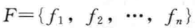
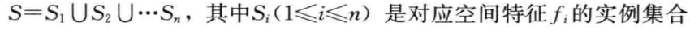
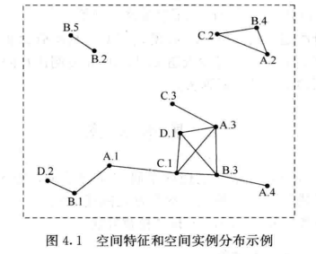
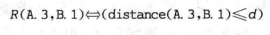
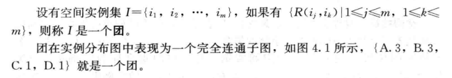
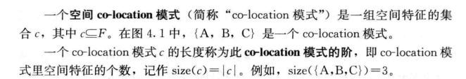
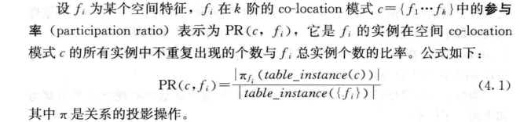
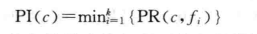
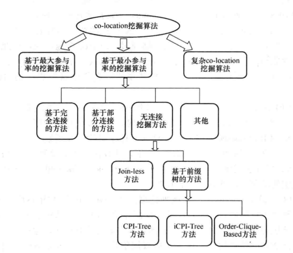
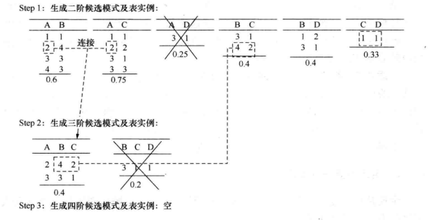

# 经典数据空间co-location模式挖掘
--------------------------------------------------

<!-- TOC -->

- [引言](#引言)
- [基本概念](#基本概念)
  - [ID3算法](#ID3算法)
  - [C4.5算法](#C4.5算法)
  - [CART算法](#CART算法)
- [剪枝处理](#剪枝处理)
  - [预剪枝](#预剪枝)
  - [后剪枝](#后剪枝)

<!-- /TOC-->
--------------------------------------------------

## 引言
- 传统的数据通常是相互独立的，而空间上分布的数据则是相关的，或者更确切地说是**空间并置的(co-located),即两个对象的位置越近，就越有可能有相似的性质。**
    - 西尼罗河病毒往往发生在蚊子泛滥，饲养家禽的区域；
    - 半湿润常绿阔叶林生长的地方80%有兰类植物生长。
- 空间co-location模式在许多应用领域发挥重要作用。
    - 移动服务运营商根据不同需求用户的分布，搭配相应的服务套餐，增加收入；
    - 广告运营商根据特定人群的聚集地段，投放相应广告。
    - 地球科学、公共卫生、公交交通、生物信息处理，...

--------------------------------------------------

## 基本概念
### 空间特征及空间实例
- 空间特征：代表了空间中不同种类的事物；
- 空间特征集：代表了空间中不同种类的事物的集合，记为:

- 空间实例：一个具体空间位置上的对象称为空间实例，将实例的集合称为实例集，记为：

- 图中共有4个空间特征A、B、C、D
    - 空间特征A有4个实例A1、A2、A3和A4;
    - B有5个实例B1、B2、B3、B4和B5;
    - C有3个实例C1、C2和C3;
    - D有2个实例D1和D2.

### 空间邻近关系
- 定义：描述了空间实例之间的空间关系。
- 空间邻近关系需要满足**自反性**和**对称性**。
- 如果定义一个空间邻近关系R为欧几里得距离小于等于用户给定的阈值d，即可表示为：

- 当两个空间实例满足空间邻近关系R时，称这两个实例**R邻近**,并在实例分布图中用线段连接它们。

### 团

### 空间co-location模式

### 行实例和表实例
- 定义：如果团I包含了co-location模式c中的所有特征，并且I中没有任何一个子集可以包含c中的所有特征，那么I就是co-location模式c的一个**行实例**，记为row-instance(c)。co-location模式c中的所有行实例的集合称为**表实例**，记为table-instance(c)。

> 示例：假设{A3,C1,C3}是一个团，但它不是co-location{A,C}的行实例，因为团{A3,C1}或者{A3,C3}就已经包含了特征A和C。而在上图中，co-location{A,B,C}的表实例为{{A2,B4,C2},{A3,B3,C1}}。

### 参与率和参与度
- 参与度：在空间数据中衡量co-location模式的频繁性（有趣程度）所有的支持度标准不同于在事务数据中所有的支持度，在co-location模式挖掘中使用参与度度量一个模式的频繁（有趣）程度。
- 参与率：

- co-location模式c的参与度表示为PI(c)，它是co-location模式c的所有空间特征的PR值的最小值：

- 设min_prev是用户给定的最小参与度（最小频繁性）阈值，当PI(c)>=min_prev时，称co-location模式c是**频繁**的。
- 示例：在上图中，特征A有4个实例，B有5个实例，C有3个实例，D有2个实例。假定一个co-location模式c={A,B,C},c的表实例{{A2,B4,C2},{A3,B3,C1}}。因为在A的实例中只有A2和A3出现在表实例中，所以PR(c,A)=2/4。类似地，PR(c,B)=2/5,PR(c,C)=2/3。最终PI(c)=min(PR(c,A),PR(c,B),PR(c,C))=2/5=0.4。

### co-location挖掘问题的流程
- 大多数co-location挖掘算法通常将挖掘任务分解为两个子任务：
    - 频繁co-location产生：其目标是发现满足最小参与度阈值min-prev的所有co-location模式
    - co-location规则产生：其目标是从上一步发现的频繁co-location模式中提取所有高条件概率的规则
- 通常，**第二个子任务的开销远低于第一个子任务的开销，co-location挖掘算法的总体性能由第一个子任务决定**。

## co-location挖掘算法分类
> co-location挖掘算法由多种分类方法，在此，我们将其分成基于最小参与率的挖掘算法，基于最大参与率的挖掘算法和复杂模式的挖掘算法3类。

### 全连接算法的基本思想
- 候选co-location的生成：
    - 通过连接两个前k-1个特征相同的频繁k阶模式P，生成k+1阶候选模式，
    - 同时检查生成的k+1阶候选模式的所有k阶子模式是否都是频繁的。
- 表实例的生成：
    - 设k阶模式c1和k阶模式c2连接得到k+1阶候选模式c3，
    - 则候选模式c3的表实例是由模式c1的表实例Tk(c1)和模式c2的表实例Tk(c2)按前k-1个特征相同进行连接，
    - 同时要求最后两个实例满足邻近关系R(last(c1),last(c2))

   

> 示例：假设最小参与度阈值**min_prev=0.3**，通过计算发现二阶模式{A,D}不是一个频繁模式，基于二阶频繁模式连接生成2个候选三阶模式{A,B,C}和{B,C,D},基于对应的二阶表实例连接生成三阶表实例。图中形象的标出了3阶候选模式{A,B,C}的行实例{A2,B4,C2}的生成过程。首先将模式{A,B}的表实例{A2,B4}和模式{A,C}的表实例{A2,C2}按前一项进行等值连接，同时检查其最后两个实例之间是否满足空间邻近关系R，这步骤可以通过查找频繁模式{B,C}的表实例来实现。

