<!-- TOC -->

- [基本流程](#基本流程)
- [划分选择](#划分选择)
  - [ID3算法](#ID3算法)
  - [C4.5算法](#C4.5算法)
  - [CART算法](#CART算法)
- [剪枝处理](#剪枝处理)
  - [预剪枝](#预剪枝)
  - [后剪枝](#后剪枝)

<!-- /TOC-->
--------------------------------------------------

## 基本流程

- 决策树基于**树结构**进行决策，决策过程的每个判定问题都是对某个属性的“测试”；
- 学习目的：为了的产生一棵**泛化能力强**，即处理未见示例能力强的决策树；
- 基本流程遵循"**分而治之**"的思想。

- 决策树的生成是一个**递归**的过程
- 有三种情况会导致递归返回
    - 当前节点所包含的样本**全部属于同一类**，无需划分 。这时将结点化为叶子结点，样本属于该类别；
    - 属性集为空或者数据集在当前属性集上所有取值相同，无法划分 。这时将结点化为叶子结点并将样本**归属于多数类**；
    - 当前节点所包含的样本集合为空，不能划分。这时将结点化为叶子结点并将样本归属于**父节点**的多数类。

--------------------------------------------------

## 划分选择
- 决策树学习的关键是**如何选择最优划分属性**
- 我们希望决策树的分支结点所包含的样本尽量属于同一类别；
- 即结点的"纯度（purity）"越来越高。

### ID3算法
#### 信息熵
- 是度量样本集合纯度最常用的一种指标。

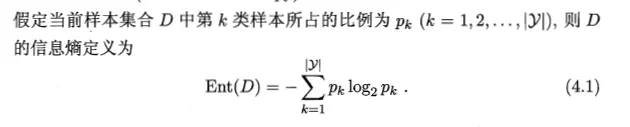

- **Ent(D)的值越小，包含的信息量就越小，D的纯度就越高。**

#### 信息增益
- 假定离散属性a有V个取值{a1...aV}；
- 若使用a对样本集D进行划分，会产生V个分支，其中第v个包含了D中在a属性上取值为av的所有样本，记为Dv；
- 再根据不同分支结点包含的样本数不同来给与权重：|Dv|/|D|
- 如此一来，属性a对样本进行划分所得的信息增益就表示为：

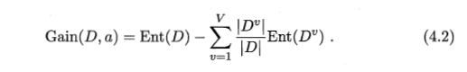

- 一般而言，信息增益越大，那么用属性a进行划分所得到的纯度提升就越大。

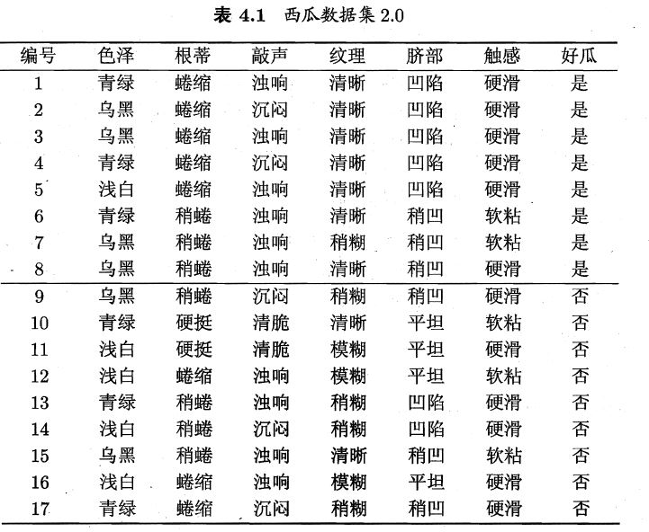

- 西瓜实例有17个，以此为例对上述内容进行计算：

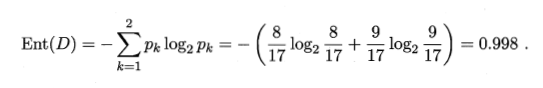

- 分别计算属性集合{色泽，根蒂，敲声，纹理，脐部，触感}每个熟悉的信息增益；
- 以属性"色泽"为例，3个可能取值{青绿，乌黑，浅白}；
- D1(色泽=青绿)，D2(色泽=乌黑)，D3(色泽=浅白)。
- 分别计算三个属性的信息熵

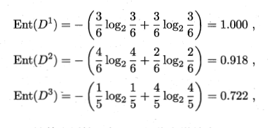

- "色泽"的信息增益

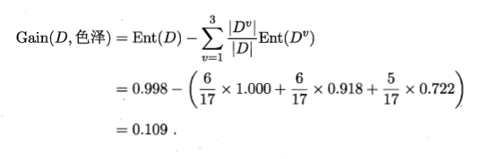

- 类似的，我们可以计算其他属性的信息增益

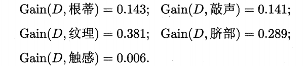

- 属性"纹理"的信息增益最大，于是它被划选为划分属性

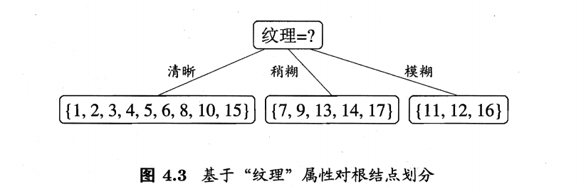

- 然后对每个分支结点做进一步划分；
- 以图4.3的第一个分支为例(纹理=清晰)
    - 包含的样例集合D1中有编号{1，2，3，4，5，6，8，10，15};
    - 可用属性集合{色泽，根蒂，敲声，脐部，触感}
    - 计算各属性的信息增益：

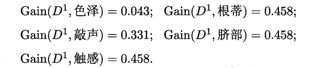

- "根蒂","脐部","触感"均取得了最大的信息增益，任选其一作为划分属性
- 同理最后可得决策树：

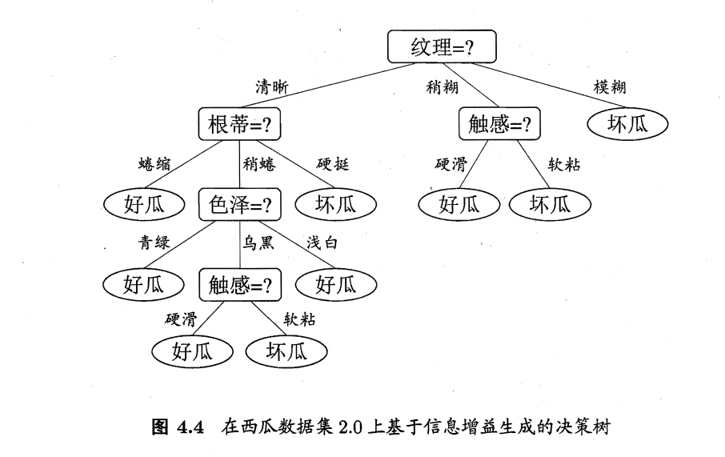

### C4.5算法
##### 增益率
- 以编号为例，17个样本中有17个编号，显然可以以此为分支，且这些分支的纯度最大。然而，这样的决策树现在不具有泛化能力；
- 信息增益对**可取较多数目的属性**有明显的偏好，为了减少这样的偏好带来的不利影响，C4.5使用增益率来选择最优划分属性；
- C4.5算法不直接采用信息增益，而是使用"增益率"来选择最优划分属性。
- 增益率的定义：

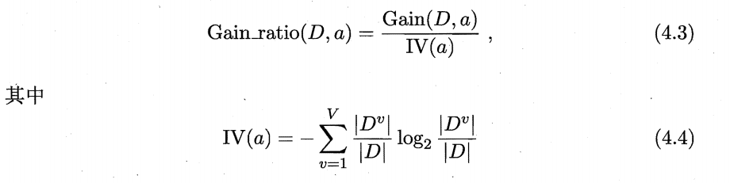

- IV(intrinsic value)称为固有值，属性a可取值越多，固有值就越大；
- 以属性"触感"为例：
    - (触感=硬滑)：12/17
    - (触感=软粘)：5/17
    - 由(公式4.4)求得：IV(触感) = 0.874
    - 同理可得：IV(色泽) = 1.580，IV(编号)=4.088
- **增益率准则对属性较少的属性有所偏好，所以C4.5不直接使用增益率最大的候选划分属性，而是先选出信息增益高于平均值的属性，再从中选择增益率最高的一个**。

### CART算法
#### 基尼指数（Gini index）
- CART决策树中，使用基尼指数来选择划分属性。
- 数据集D的纯度可以用基尼值来度量。
- 基尼值定义：

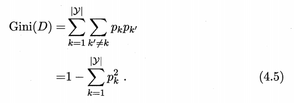

- 基尼指数定义：

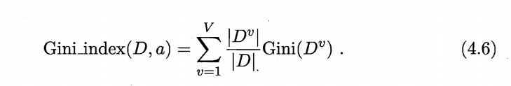

- Gini(D)反应了从数据集D中随机选择两个样本，其类别标记不同的概率，因此，Gini指数越低，数据集D的纯度越高。
- **基尼指数越小，属性越优**。

--------------------------------------------------
## 剪枝处理
- 剪枝是决策树中处理**过拟合**的主要手段；
- 决策树学习过程中，结点划分不断重复，有时会造成决策树分支过多，进而导致过拟合。因此，需要通过一些手段主动的去掉一些分支；
- 主要有两种手段，预剪枝和后剪枝。

### 预剪枝
- 预剪枝：是在决策树生成过程中，对每个结点在**划分前**进行估计。如果这个节点进行划分，**不能带来泛化性能的提升，则停止划分并将该节点设置为叶子节点**。
- 后剪枝：先训练好一棵树，然后**自底向上**对**非叶子节点**进行考察，如果将该节点对应的子树替换为叶节点能带来**泛化性能的提升**，能就将该子树替换为叶节点。
- 训练集和测试集

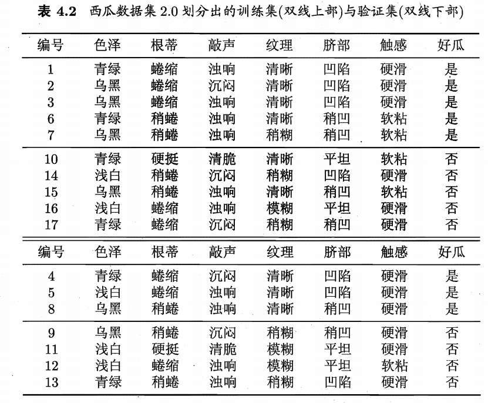

- 将数据集2.0分成了训练集和测试集，由训练集重新计算信息增益，我们会选取属性"脐部"来对训练集进行划分，并产生3个分支

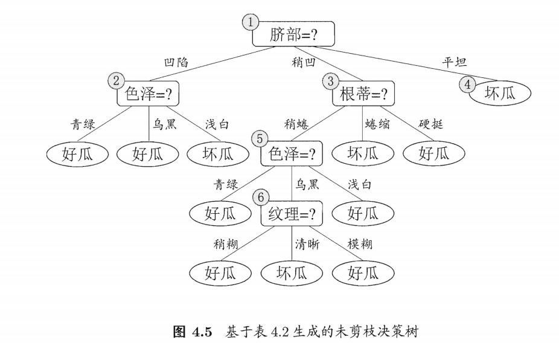

- 在划分之前，所有样例集中在根结点(脐部).将其标记为训练样例数最多的类别，这里有{好瓜：不是好瓜}={5：5},因为两个类别数量相等，故可以任意选一个。(这里将其标记为"好瓜")
- 用表 4.2的验证集对这个单结点决策树进行评估，则编号为{4,5,8}的样例被分类正确，另外4个样例分类错误，于是，验证集精度为3/7*100% =42.9%;
- 最后结果如图所示：

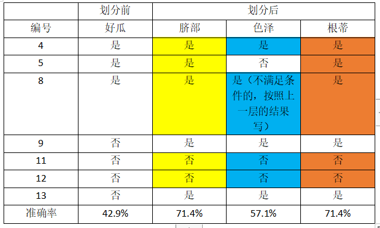

- 优点：预剪枝使得决策树很多分支都没有“展开”，这不仅**降低了过拟合的风险，还显著减少来决策树的训练时间开销和测试时间开销**。
- 缺点：虽然某次划分可能并不能带来性能上的提升，但是后序的划分可能会带来性能上的提升；预剪枝基于**“贪心”的本质给决策树带来欠拟合的风险**。

### 后剪枝
- 后剪枝先从训练集生成一棵完整的决策树
- 基于表4.2的数据我们得到图4.5的决策树，该决策树的验证集精度为42.5%

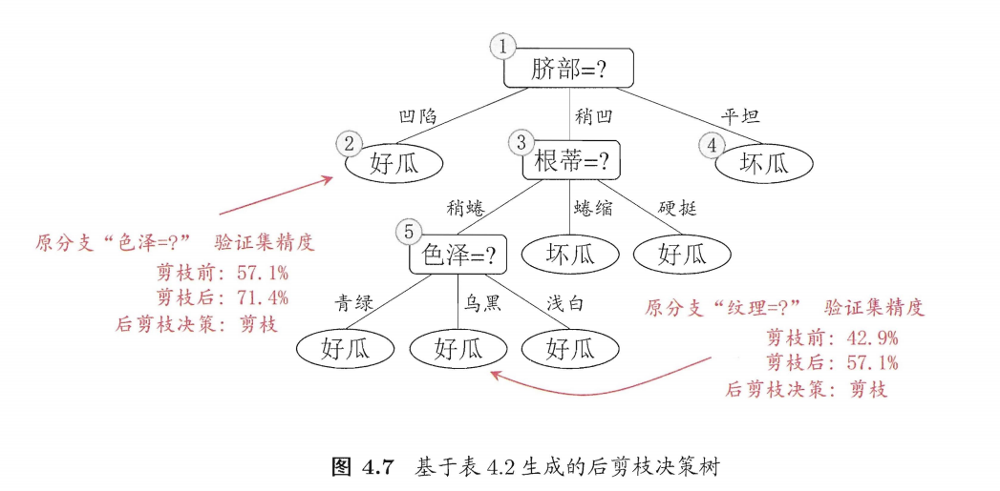

- 优点：后剪枝通常比预剪枝保留更多的分支，所以后剪枝决策树的**欠拟合风险较小**，泛化性能往往犹豫预剪枝决策树。
- 缺点：因为在生成了完整的决策树后进行，所以其训练开销高于预剪枝决策树。
