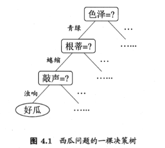
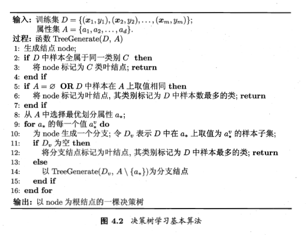

<!-- TOC -->

- [基本流程](#基本流程)
  - [知识图谱的基石](#知识图谱的基石)
  - [RDF的三种类型](#RDF的三种类型)
  - [RDF序列化方法](#RDF序列化方法)
- [RDF的“衣服”——RDFS/OWL](#RDF的“衣服”——RDFS/OWL)
- [RDFS](#RDFS)
- [OWL](#OWL)
  - [数据建模能力](#数据建模能力)
  - [推理能力](#推理能力)
<!-- /TOC-->
--------------------------------------------------

## 基本流程
- 决策树基于**树结构**进行决策，决策过程的每个判定问题都是对某个属性的“测试”；

- 学习目的：为了的产生一棵**泛化能力强**，即处理未见示例能力强的决策树；
- 基本流程遵循"分而治之"的思想。

