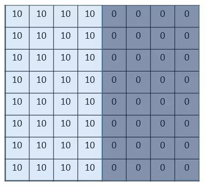
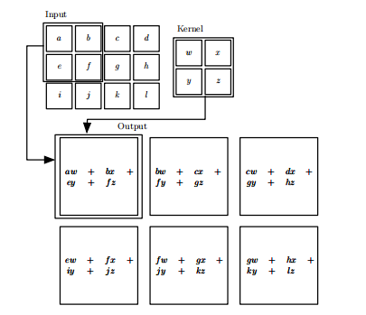
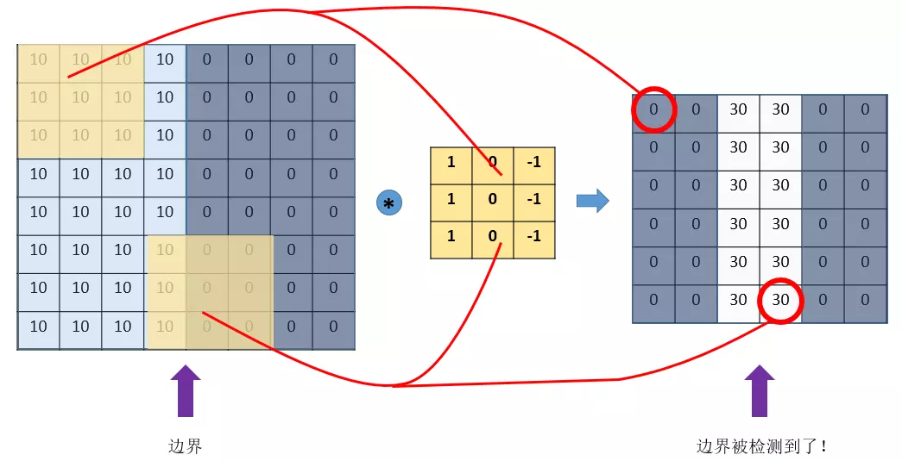
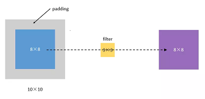
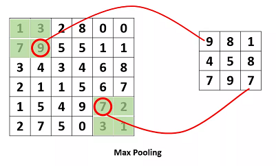
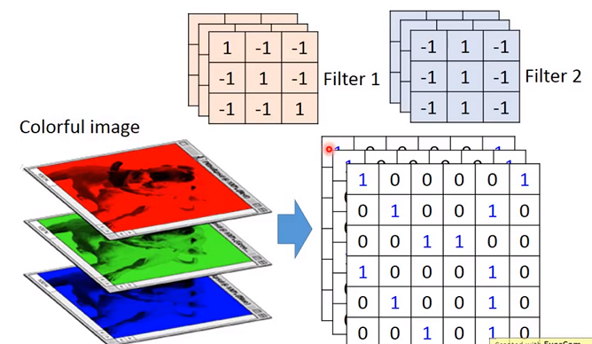
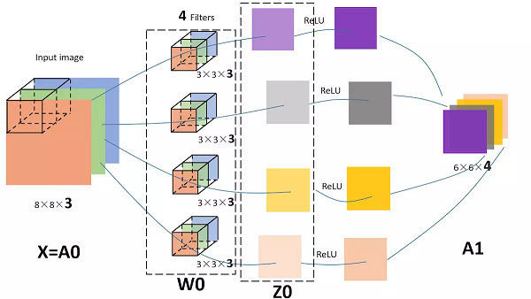
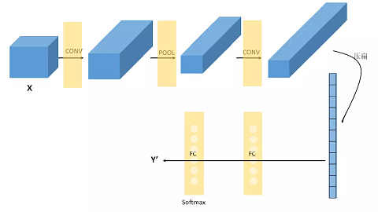
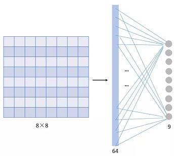
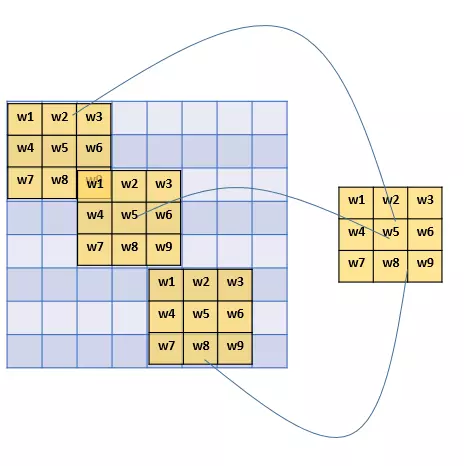

<!-- TOC -->

- [引子](#引子)
- [CNN基本原理](#CNN基本原理)
  - [padding填白](#padding填白)
  - [stride步长](#stride步长)
  - [pooling池化](#pooling池化)
  - [对多通道图片的卷积](#对多通道图片的卷积)
- [CNN的结构组成](#CNN的结构组成)
  - [Convolutional layer](#Convolutional_layer)
  - [Pooling_layer](#Pooling_layer)
  - [Fully_Connected_layer](#Fully_Connected_layer)
- [卷积神经网络VS传统神经网络](#卷积神经网络VS传统神经网络)
<!-- /TOC-->
--------------------------------------------------

## 引子
- 我们来看一个最简单的例子：“边界检测（edge detection）”；
- 假设我们有这样的一张图片，大小8×8：

- 图片中的数字代表该位置的像素值，我们知道，像素值越大，颜色越亮，所以为了示意，我们把右边小像素的地方画成深色；
- 图的中间两个颜色的分界线就是我们要检测的边界。
- 怎么检测这个边界呢？我们可以设计这样的一个**滤波器（filter，也称为kernel）**，大小3×3：

- 然后，我们用这个filter，往我们的图片上“盖”，覆盖一块跟filter一样大的区域之后，对应元素相乘，然后求和。
- 计算一个区域之后，就向其他区域挪动，接着计算，直到把原图片的每一个角落都覆盖到了为止。这个过程就是**卷积**。
- ps:我们不用管卷积在数学上到底是指什么运算，我们只用知道在CNN中是怎么计算的。
- 如何计算一个区域：

- 这里的“挪动”，就涉及到一个**步长**了，假如我们的步长是1，那么覆盖了一个地方之后，就挪一格，容易知道，总共可以覆盖6×6个不同的区域。
- 那么，我们将这6×6个区域的卷积结果，拼成一个矩阵：

- 这个图片，中间颜色浅，两边颜色深，这说明咱们的原图片中间的边界，在这里被反映出来了!
- 从上面这个例子中，我们发现，**我们可以通过设计特定的filter，让它去跟图片做卷积，就可以识别出图片中的某些特征**，比如边界。
- 上面的例子是检测竖直边界，我们也可以设计出检测水平边界的，只用把刚刚的filter旋转90°即可。
- 对于其他的特征，理论上只要我们经过精细的设计，总是可以设计出合适的filter的。
- **我们的CNN（convolutional neural network），主要就是通过一个个的filter，不断地提取特征，从局部的特征到总体的特征，从而进行图像识别等等功能。**
- 如何设计filter？
    - 首先，我们都不一定清楚对于一大堆图片，我们需要识别哪些特征，
    - 其次，就算知道了有哪些特征，想真的去设计出对应的filter，恐怕也并非易事，要知道，特征的数量可能是成千上万的。
- 其实学过神经网络之后，我们就知道，**这些filter，根本就不用我们去设计**，每个filter中的各个数字，不就是参数吗，我们可以通过大量的数据，来让**机器自己去“学习”这些参数嘛**。这，就是CNN的原理。

--------------------------------------------------

## CNN基本原理
### padding填白
- 从上面的引子中，我们可以知道，原图像在经过filter卷积之后，变小了，从(8,8)变成了(6,6)。假设我们再卷一次，那大小就变成了(4,4)了。
- 主要有两个问题：
    - 每次卷积，图像都缩小，这样卷不了几次就没了；
    - **相比于图片中间的点，图片边缘的点在卷积中被计算的次数很少。这样的话，边缘的信息就易于丢失**。
- 为了解决这个问题，我们可以采用padding的方法。
    - 我们每次卷积前，先给图片周围都补一圈空白，让卷积之后图片跟原来一样大，同时，原来的边缘也被计算了更多次。
    

- 比如，我们把(8,8)的图片给补成(10,10)，那么经过(3,3)的filter之后，就是(8,8)，没有变。
- 我们把上面这种**让卷积之后的大小不变**的padding方式，称为**Same方式**，
- **把不经过任何填白的，称为 “Valid”方式。**
- 这个是我们在使用一些框架的时候，需要设置的**超参数**。

### stride步长
- 前面我们所介绍的卷积，都是默认步长是1，但实际上，我们可以设置步长为其他的值。
- 比如，对于(8,8)的输入，我们用(3,3)的filter，
- 如果stride=1，则输出为(6,6);
- 如果stride=2，则输出为(3,3);（这里例子举得不大好，**除不断就向下取整**）
    - 除不断向下取整的解释
    - 假设stride=2,计算行：
        - [8(输入行) - 3(filter行)]/2(步长) + 1(初始的状态，形状和filter一样)= 3.5(向下取整) = 3
        - 列同理，所以输出的shape：(3,3)

### pooling池化
- **是为了提取一定区域的主要特征，并减少参数数量，防止模型过拟合。**
- 比如下面的MaxPooling，采用了一个2×2的窗口，并取stride=2：
    

  

- 除了MaxPooling,还有AveragePooling，顾名思义就是取那个区域的平均值。

### 对多通道图片的卷积
- 彩色图像，一般都是RGB三个通道（channel）的，因此输入数据的维度一般有三个：（**长，宽，通道**）。
比如一个28×28的RGB图片，维度就是(28,28,3)。

  

- 前面的引子中，输入图片是2维的(8,8)，filter是(3,3)，输出也是2维的(6,6)。
- 如果输入图片是三维的呢（即增多了一个channels），比如是(8,8,3)，这个时候，我们的filter的维度就要变成(3,3,3)了，它的最后一维要跟输入的channel维度一致。
- 这个时候的卷积，是三个channel的所有元素对应相乘后求和，也就是**之前是9个乘积的和，现在是27个乘积的和。因此，输出的维度并不会变化**。还是(6,6)。
- **多个filters会增加输出的维度**，比如，如果我们同时使用4个filter的话，那么 输出的维度则会变为(6,6,4)。

 

- 图中的输入图像是(8,8,3)，filter有4个，大小均为(3,3,3)，得到的输出为(6,6,4)。

--------------------------------------------------
## CNN的结构组成
### Convolutional_layer
- 卷积层--CONV：
    - 由滤波器filters和激活函数构成。
    - 一般要设置的超参数包括filters的数量、大小、步长，以及padding是“valid”还是“same”。当然，还包括选择什么激活函数。
    
### Pooling_layer
- 池化层--POOL：
    - 这里里面没有参数需要我们学习，因为这里里面的参数都是我们设置好了，要么是Maxpooling，要么是Averagepooling。
    - 需要指定的超参数，包括是Max还是average，窗口大小以及步长。
    - 通常，我们使用的比较多的是Maxpooling,而且一般取大小为(2,2)步长为2的filter，这样，经过pooling之后，输入的长宽都会缩小2倍，channels不变。
 
### Fully_Connected_layer
- 全连接层--FC:
    - 神经网络中的那种最普通的层，就是一排神经元。因为**这一层是每一个单元都和前一层的每一个单元相连接，所以称之为“全连接”**。
    - 这里要指定的超参数，无非就是神经元的数量，以及激活函数。 
- 接下来，我们随便看一个CNN的模样，来获取对CNN的一些感性认识：

 

- 在经过数次卷积和池化之后，我 最后会先**将多维的数据进行扁平化**，也就是把 (height,width,channel)的数据压缩成长度为 height × width × channel 的一维数组，然后再与FC层连接，这之后就跟普通的神经网络无异了。
- 可以从图中看到，随着网络的深入，我们的图像（严格来说中间的那些不能叫图像了，但是为了方便，还是这样说吧）越来越小，但是channels却越来越大了。在图中的表示就是长方体面对我们的面积越来越小，但是长度却越来越长了。

--------------------------------------------------
## 卷积神经网络VS传统神经网络
- 其实现在回过头来看，CNN跟我们之前学习的神经网络，也没有很大的差别。
- 传统的神经网络，其实就是多个FC层叠加起来。
- CNN，无非就是把FC改成了CONV和POOL，就是把传统的由一个个神经元组成的layer，变成了由filters组成的layer。
- 为什么要这样变？有什么好处？

### 参数共享机制
- 对比一下传统神经网络的层和由filters构成的CONV层：
- 假设我们的图像是8×8大小，也就是64个像素，假设我们用一个有9个单元的全连接层：

 

- 那这一层我们需要多少个参数呢？需要**64×9 = 576**个参数（先不考虑偏置项b）。因为每一个链接都需要一个权重w。
- 那我们看看**同样有9个单元的filter**是怎么样的：

 

- 其实不用看就知道，有几个单元就几个参数，所以总共就9个参数！
- 因为，**对于不同的区域，我们都共享同一个filter，因此就共享这同一组参数**。
- **filter是用来检测特征的，那一个特征一般情况下很可能在不止一个地方出现**，比如“竖直边界”，就可能在一幅图中多出出现，那么我们共享同一个filter不仅是合理的，而且是应该这么做的。
-由此可见，参数共享机制，让我们的网络的**参数数量大大地减少**。这样，我们可以用较少的参数，训练出更加好的模型，典型的事半功倍，而且可以有效地**避免过拟合。**
- 同样，由于filter的参数共享，即使图片进行了一定的平移操作，我们照样可以识别出特征，这叫做 **平移不变性**。因此，模型就更加稳健了。

### 连接的稀疏性
- 由卷积的操作可知，**输出图像中的任何一个单元，只跟输入图像的一部分有关系**：

 

- 而传统神经网络中，由于都是全连接，所以输出的任何一个单元，都要受输入的所有的单元的影响。这样无形中会对图像的识别效果大打折扣。比较，每一个区域都有自己的专属特征，我们不希望它受到其他区域的影响。
