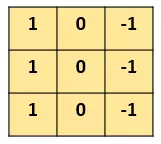

<!-- TOC -->

- [引子](#引子)
- [划分选择](#划分选择)
  - [ID3算法](#ID3算法)
  - [C4.5算法](#C4.5算法)
  - [CART算法](#CART算法)
- [剪枝处理](#剪枝处理)
  - [预剪枝](#预剪枝)
  - [后剪枝](#后剪枝)

<!-- /TOC-->
--------------------------------------------------

## 引子
- 我们来看一个最简单的例子：“边界检测（edge detection）”；
- 假设我们有这样的一张图片，大小8×8：

- 图片中的数字代表该位置的像素值，我们知道，像素值越大，颜色越亮，所以为了示意，我们把右边小像素的地方画成深色；
- 图的中间两个颜色的分界线就是我们要检测的边界。
- 怎么检测这个边界呢？我们可以设计这样的一个**滤波器（filter，也称为kernel）**，大小3×3：

- 然后，我们用这个filter，往我们的图片上“盖”，覆盖一块跟filter一样大的区域之后，对应元素相乘，然后求和。
- 计算一个区域之后，就向其他区域挪动，接着计算，直到把原图片的每一个角落都覆盖到了为止。这个过程就是** “卷积”**。
- ps:我们不用管卷积在数学上到底是指什么运算，我们只用知道在CNN中是怎么计算的。
- 如何计算一个区域：

- 这里的“挪动”，就涉及到一个**步长**了，假如我们的步长是1，那么覆盖了一个地方之后，就挪一格，容易知道，总共可以覆盖6×6个不同的区域。
- 那么，我们将这6×6个区域的卷积结果，拼成一个矩阵：

